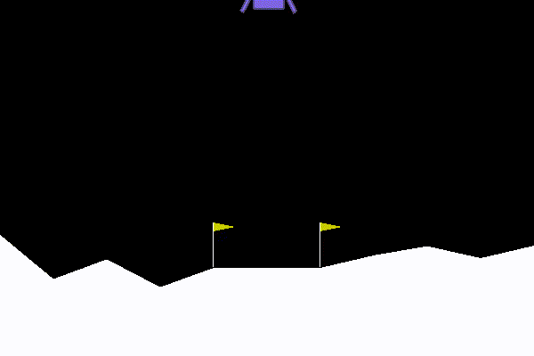

# HW 11 Reinforcement Learning with OpenGym

[](https://objects-sirakzg-w251.s3.us-east.cloud-object-storage.appdomain.cloud/LunarLander/episode510.mp4)


### Questions

#### 1. 
I trained the Lunar Lander model with the following parameters, leaving only num_epochs unchanged:

``` python
        self.density_first_layer = 250
        self.density_second_layer = 150
        self.num_epochs = 1
        self.batch_size = 128
        self.epsilon_min = 0.001
```

#### 2. 
I did run a test with `num_epochs` set to 100 but noticed the lunar window tended to lag between episodes. Instead I upped the batch size to 128 since the DNQ model was so small compared to a CNN network. I also played around with the epsilon decay and variables but wasn't able to get anything to train successfully.

#### 3. 
I did a test run with epsilon decay set to `0.95` and found that epsilon decay'd way too early to allow a successful training run. I also did many early test runs with the first two density layers set to smaller numbers like 32 and 16: since I didn't have the access to add additional layers I tested with the much larger sizes above and got better results. 

#### 4. 
Increasing the density layers to the values above made the most significant improvements and resulting in one of my test runs where only one of the scores was below 200. (Due to the memory error I ran my settings a second time overnight and didn't get my Average Reward print out from the script directly.)

Test Run 1: Average Score 231.659
```
Starting Testing of the trained model...
0 : Episode || Reward:  238.51966391842765
1 : Episode || Reward:  228.00250656780176
2 : Episode || Reward:  219.58694892437637
3 : Episode || Reward:  257.40652369869036
4 : Episode || Reward:  222.070951235245
5 : Episode || Reward:  190.65793831752185
6 : Episode || Reward:  222.8140212313104
7 : Episode || Reward:  246.58024951216473
8 : Episode || Reward:  257.677800330818
9 : Episode || Reward:  249.7977519578318
10 : Episode || Reward:  215.1399199933074
Traceback (most recent call last):
  File "agent_lunar_lander.py", line 260, in <module>
    skvideo.io.vwrite(fname, np.array(frames))
MemoryError: Unable to allocate 2.40 GiB for an array with shape (3581, 400, 600, 3) and data type uint8

real 383m13.032s
user 0m5.320s
sys 0m0.420s
```

Test Run 2: Average Score 237.145
```
Starting Testing of the trained model...
0 : Episode || Reward:  133.44152217542523
1 : Episode || Reward:  245.29862174984757
2 : Episode || Reward:  274.61848178509615
3 : Episode || Reward:  218.86257367673488
4 : Episode || Reward:  279.37500387347893
5 : Episode || Reward:  155.8961783294013
6 : Episode || Reward:  258.3949193748402
7 : Episode || Reward:  279.7479515078428
8 : Episode || Reward:  125.63343165554276
9 : Episode || Reward:  243.332481682972
10 : Episode || Reward:  266.7110500050317
11 : Episode || Reward:  300.59553419804877
12 : Episode || Reward:  249.29861897960492
13 : Episode || Reward:  273.6310911430463
14 : Episode || Reward:  267.57906667701036
15 : Episode || Reward:  221.97518070217205

real 536m9.104s
user 0m5.984s
sys 0m14.612s
```
#### 5. 
The first two variables are for the size of the dense layers in our artificial neurla network, and as we can see by the print out below results in a model with `19,954` total parameters. Batch size allows us to specify how many frames to grab from our current run, as the same values for reward can by used within a run.  Epoch number specifies to Keras how many times to train the model on this particular batch within each episodes run.

```
Model: "sequential_1"
_________________________________________________________________
Layer (type)                 Output Shape              Param #  
=================================================================
dense_1 (Dense)              (None, 150)               1350      
_________________________________________________________________
dense_2 (Dense)              (None, 120)               18120    
_________________________________________________________________
dense_3 (Dense)              (None, 4)                 484      
=================================================================
Total params: 19,954
Trainable params: 19,954
Non-trainable params: 0
```

#### 6. 
The epsilon parameter is used to determine a probability at each step of either using the highest scoring action, or a random action. Over time random actions are reduced using `epsilon_decay` to the point where a clear majority of steps will use the optimal actions rather than a random action.  The variable epsilon_min allows us to keep some chance for random actions in the case that epsilon is decayed to a very small number.

For example in my first successful training run epsilon starts at the following:

```
0 : Episode || Reward:  -212.31146135603169 || Average Reward:  -212.31146135603169 epsilon:  0.995
1 : Episode || Reward:  -225.38897378773748 || Average Reward:  -218.85021757188457 epsilon:  0.990025
2 : Episode || Reward:  -195.78135306829228 || Average Reward:  -211.16059607068715 epsilon:  0.985074875
3 : Episode || Reward:  -8.896100199539845 || Average Reward:  -160.59447210290034 epsilon:  0.9801495006250001
4 : Episode || Reward:  -222.1850524452596 || Average Reward:  -172.9125881713722 epsilon:  0.9752487531218751
5 : Episode || Reward:  -148.11158388159262 || Average Reward:  -168.77908745640892 epsilon:  0.9703725093562657
6 : Episode || Reward:  -91.61697209471723 || Average Reward:  -157.75592811902442 epsilon:  0.9655206468094844
```

and completes as:

```
513 : Episode || Reward:  215.7131083198279 || Average Reward:  198.49690855600667 epsilon:  0.07604374613140748
514 : Episode || Reward:  214.40106413455948 || Average Reward:  198.04780416562033 epsilon:  0.07566352740075044
515 : Episode || Reward:  272.8993534253663 || Average Reward:  198.35986359550705 epsilon:  0.07528520976374668
516 : Episode || Reward:  247.1621815459431 || Average Reward:  198.29400795594904 epsilon:  0.07490878371492794
517 : Episode || Reward:  179.340569122677 || Average Reward:  197.88741347784287 epsilon:  0.0745342397963533
518 : Episode || Reward:  268.28654224350555 || Average Reward:  199.6716349210496 epsilon:  0.07416156859737154
519 : Episode || Reward:  218.24167261252 || Average Reward:  199.4475822457727 epsilon:  0.07379076075438468
520 : Episode || Reward:  233.9110658294892 || Average Reward:  199.4414567130524 epsilon:  0.07342180695061275
DQN Training Complete...
```

#### 7. 
"Q-Learning" is a reinforcement learning algorith that learns an action policy for an agent that is the highest scoring predicted action given that particular state. Q-Learning is model free, meaning it does not require any external model of the environment and hence can learn from just the actions and rewards reported at each step.

### Videos:

https://objects-sirakzg-w251.s3.us-east.cloud-object-storage.appdomain.cloud/LunarLander/episode0.mp4

https://objects-sirakzg-w251.s3.us-east.cloud-object-storage.appdomain.cloud/LunarLander/episode200.mp4

https://objects-sirakzg-w251.s3.us-east.cloud-object-storage.appdomain.cloud/LunarLander/episode510.mp4

https://objects-sirakzg-w251.s3.us-east.cloud-object-storage.appdomain.cloud/LunarLander/testing_run0.mp4

https://objects-sirakzg-w251.s3.us-east.cloud-object-storage.appdomain.cloud/LunarLander/testing_run10.mp4
