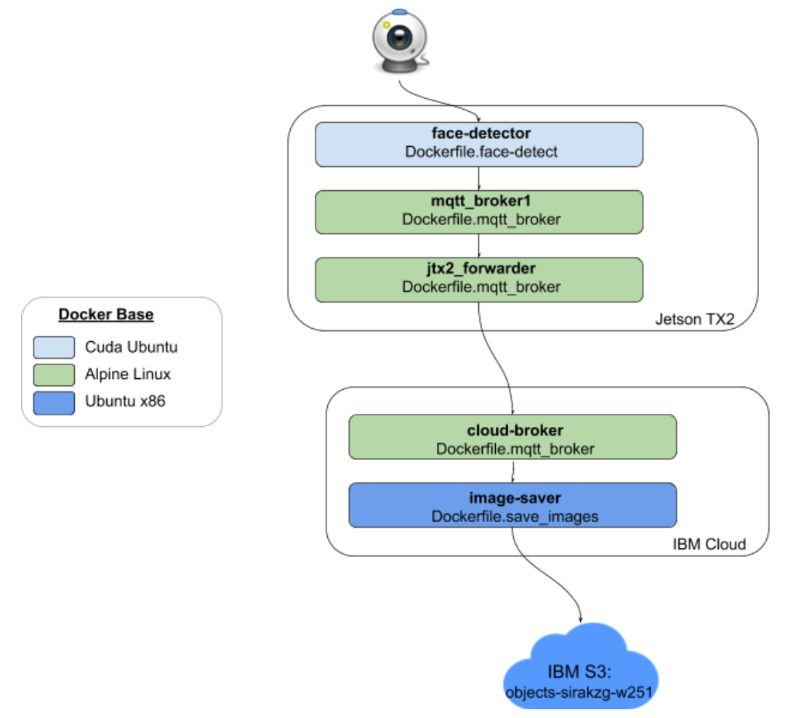

# Homework 3 - Internet of Things 101

The goal of this assignment is to stream captured face data from a webcam connected to a Jeston TX2, and store it in cloud storage using IBM's S3 buckets. The following is a diagram highlighting the connections between all the containers.



## Jetson Containers

A docker bridge for the three containers that run on the Jeston to talk to each other via their docker name:

```docker network create --driver bridge face-bridge```

Custom containers were created for each docker image used in this submission.  For the Dockerfile.face-detect I edited the yolo container from our week 1 lab, removing yolo commands and added support for `paho-mqtt`.  This container also copies the python script to run, as well as the OpenCV Haar-Cascade .xml file needed for front-face detection.  No arguments are passed to this python script and the docker is run simply as:

```sudo docker run --name face-detector -e DISPLAY=$DISPLAY --privileged --network face-bridge --env QT_X11_NO_MITSHM=1 --rm -d face-detect```

A slim docker container is used for the MQTT brokers throughout the submission, based on Alpine linux and installs mosquitto and mosquitto-clients.  The docker images are run by mounting a volume to the directory containing the conf files, and passing an environment variable indicating it's specific config file to run.  The config files are used to indicate port, the connection bridge, forwarding address and port, as well as which topic to subscribe to.

```
sudo docker run --name mqtt_broker1 --network face-bridge -v ~/w251_projects/week3hw/:/w251 --env MQTT_CONFIG='/w251/jtx2_broker.conf' --rm -d mqtt_broker
sudo docker run --name jtx2_forwarder --network face-bridge -v ~/w251_projects/week3hw/:/w251 --env MQTT_CONFIG='/w251/jtx2_forwarder.conf' --rm -d mqtt_broker
```


## Cloud containers

On an IBM Cloud virtual server I create the same docker bridge and startup an MQTT broker to receive messages from the Jetson:

```
docker network create --driver bridge face-bridge
docker run --name cloud-broker -p 1883:1883 --network face-bridge -v ~/w251_projects/week3hw:/w251 --env MQTT_CONFIG='/w251/cloud_broker.conf' --rm -d mqtt_broker
```

The final container runs a python script image_saver.py to receive MQTT messages from the cloud broker above, converts the byte arrays back into images and saves to a specified location. The docker file uses a Ubuntu base and installs python3, pip3, opencv and paho-mqtt.  When run an environment variable `SAVE_FOLDER` is used to pass along the destination location of the images.

```
sudo s3fs objects-sirakzg-w251 /mnt/ibm-objstore/ -o passwd_file=$HOME/.cos_creds -o sigv2 -o use_path_request_style -o url=https://s3.us-east.objectstorage.softlayer.net
docker run --name image-saver --network face-brid --env SAVE_FOLDER='/ibmcloud' --rm -d -v /mnt/ibm-objstore:/ibmcloud/w251 image-saver
```


## MQTT Settings

The MQTT protocal provides a couple communication options in the name of the topic, and the desired quality of service (QoS) to use for each message.  For this submission I used the topic `face_detect/#`, with the wildcard ending to support additional levels.  I used `QoS=1`, which guarantees packets are sent at least once until a confirmation packet is receieved.

## Sample Images
https://objects-sirakzg-w251.s3.us-east.cloud-object-storage.appdomain.cloud/w251/face_1589745673.png


https://objects-sirakzg-w251.s3.us-east.cloud-object-storage.appdomain.cloud/w251/face_1589745705.png


For instructions on this assignment see [week03/hw](https://github.com/MIDS-scaling-up/v2/tree/master/week03/hw).
