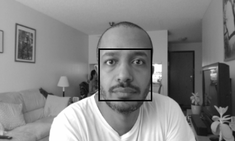

# HW 7 Questions

## 1) Implementation

I decided to base my deep learning facial recognition algorithm on a model I trained using the Facial Landmarks dataset provided by Kaggle (for more info refer to my models repo https://github.com/sirakzg/faciallandmarks), and specifically the Facial_Landmarks notebook.

There were a few hurdles getting this model to act similarly to a Yolo type model: it was trained on input resolutions of 96x96 grayscale images and so a manual tiling across the webcam's resolution of 480x288 was required. Also I had to tranlate the outputed paired landmark positions into a bounding box around the face by calculating the min/max x and y values found in each tile.  

https://objects-sirakzg-w251.s3.us-east.cloud-object-storage.appdomain.cloud/w251/face_1592170144.png

Included in this assignments folder are the docker file `Dockerfile.face-landmarks` which was repurposed from HW3 but instead of using the CUDA base image it's now using the Tensorflow image.  The python script `landmarks_faceDetector.py` is also modified from HW3's OpenCV version of the script but now opens a pretrained Keras model from my Facial Landmarks project.

## 2) Accuracy

While accuracy seemed fairly good I noticed that my implmentation failed to draw bounding boxes across tiles, making it obvious when I moved from one tile to another. This is due to the limitation of the underlying model and training data provided not able to extrapolate facial landmark data beyond the boundries of the image. 

## 3) Performance

I noticed a very performant framerate in an early stage when I was not yet tiling of 12-15 frames per second on the Jetson TX2. Unfortunately once I added tiling across the full 480x288 image frame rate dropped to 1 fps. An implementation involving batch predictions combining several tiles together could help boost performance overall. 

## 4) Comparisons

While I personally preferred the quality of this model over the one from HW3s OpenCV version I still prefer the OpenCV implementation due to it's ease of use (ie no tiling) and easier access to facial bounding boxes.
