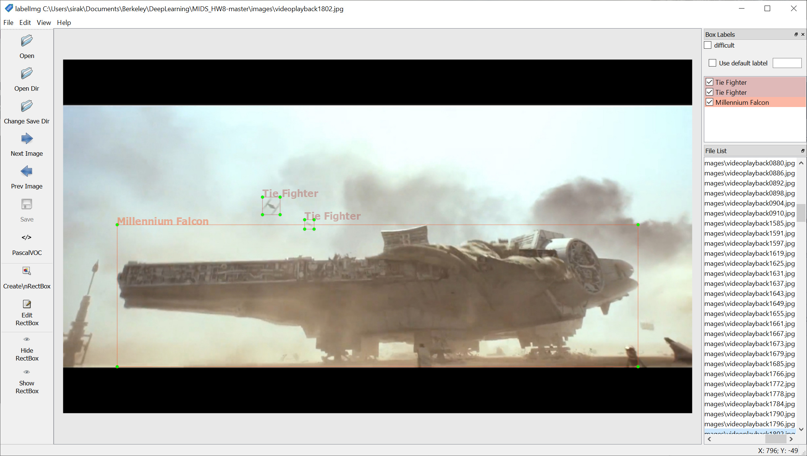

# HW 8 Questions

### Image Augmentations

Describe the image augmentation operations of the tool https://github.com/codebox/image_augmentor:

 - Flip: mirrors the image in either vertically or horizontally
 - Rotation: rotates the image to an arbitrary angle
 - Scale: can either increase the size of the image, or zoom in which increases the content of the image without changing it's resolution
 - Crop: cuts and keeps just a particular section of the image 
 - Translation: is usually a 2D movement of the image contents.
 - Noise: adds random values on a per pixel basis
 
### Audio Augmentations

Using the audio annotation tool provided at https://github.com/CrowdCurio/audio-annotator, audio annotations differ from image annotations in that they require just a start and end timestamp, as well as a class label and any other tags we wish to associate with each image (ie in the provided examples we also labelled audio as near, far, etc).
