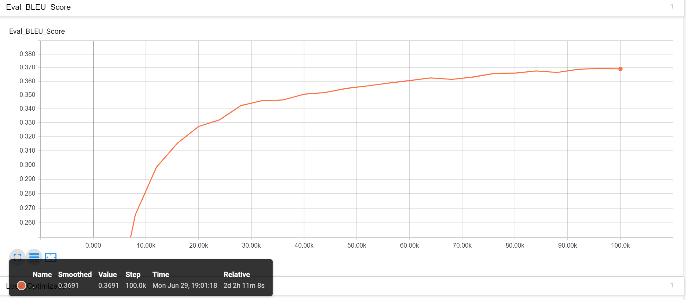
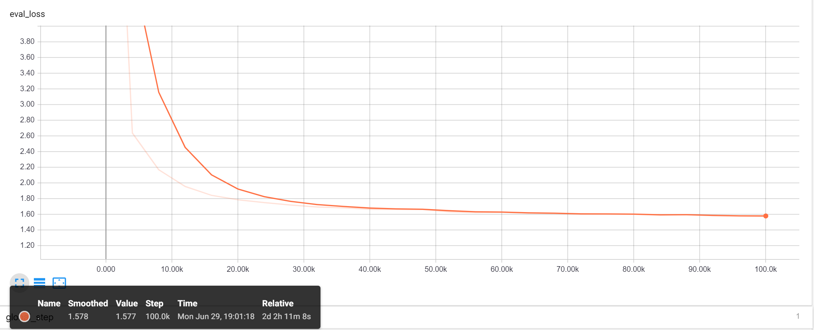
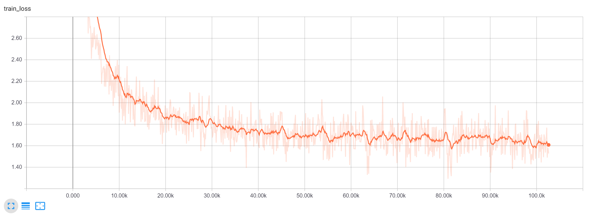
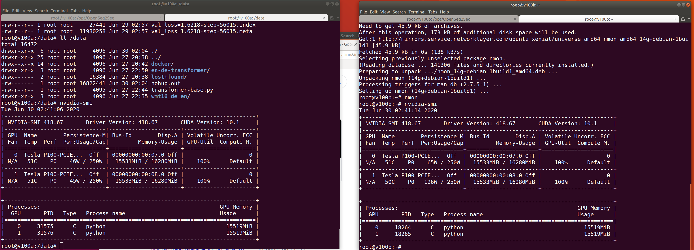
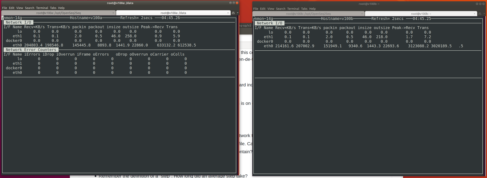
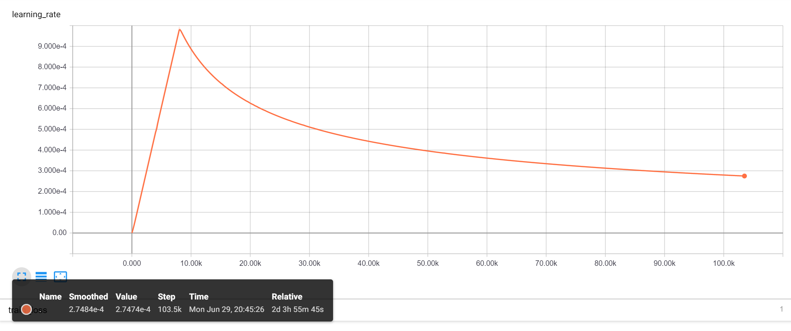

# HW 9 Distributed Training and Neural Machine Translation

### Questions

 - As we can see in this chart it took 50 hours to reach 100k iterations, one-third the 300k iterations the default script is setup to run. 
 
 

 - Judging from our evaluation loss at 100k iterations we are very close to the expected final eval loss shwon in the homework description (https://github.com/MIDS-scaling-up/v2/tree/master/week09/hw). However loss is not always a good measure of how good a model will perform, and as we compare our BLEU scores from above with that of the expected result after 300k iterations being closer to 0.38 instead of our achieved value of 0.369.
 
 
 

  - Overfitting is probably occuring as we compare the eval loss to the training loss charts, where training loss is still progressively reducing while our evaluation loss has remained stagnant.
  
  
 

  - Shortly after training started I took a screen grab of the NVidia tool `nvidia-smi` running on both P100 servers (note the hostnames say v100's in error).  Utilization showed 100% GPU usage across all four GPUs.
  
  
 

 - Monitoring of network traffic was done using the tool `nmon`, and while network bandwith was fairly substantial I don't believe it was a bottle neck in our training.  If I had been able to successfully request 4 V100s on the IBM cloud instead of the P100s, their faster compute and training with a larger batch size would probably have caused a larger strain on networking.
 
  

 - 

### Image Augmentations

Describe the image augmentation operations of the tool https://github.com/codebox/image_augmentor:
