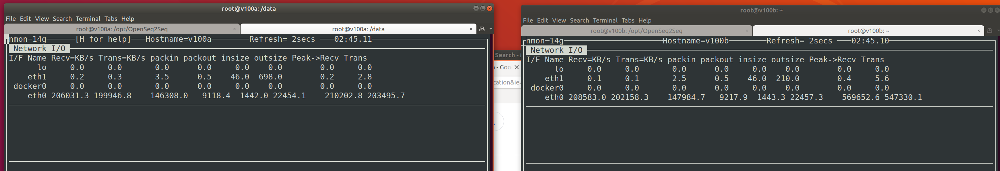

# HW 9 Distributed Training and Neural Machine Translation

### Questions

 - As we can see in this chart it took 50 hours to reach 100k iterations, one-third the 300k iterations the default script is setup to run. 
 
 

 - Judging from our evaluation loss at 100k iterations we are very close to the expected final eval loss shwon in the homework description (https://github.com/MIDS-scaling-up/v2/tree/master/week09/hw). However loss is not always a good measure of how good a model will perform, and as we compare our BLEU scores from above with that of the expected result after 300k iterations being closer to 0.38 instead of our achieved value of 0.369.
 
 
 

  - Overfitting is probably occuring as we compare the eval loss to the training loss charts, where training loss is still progressively reducing while our evaluation loss has remained stagnant.
  
  
 

  - Shortly after training started I took a screen grab of the NVidia tool `nvidia-smi` running on both P100 servers (note the hostnames say v100's in error).  Utilization showed 100% GPU usage across all four GPUs.
  
  
 

 - Monitoring of network traffic was done using the tool `nmon`, and while network bandwith was fairly substantial I don't believe it was a large bottleneck in our training.  If I had been able to successfully request 4 V100s on the IBM cloud instead of the P100s, their faster compute and training with a larger batch size would probably have caused a larger strain on networking.
 
  

 - The Learning rate is manipulated over the course of the training processes, first going thru some `warmup` phase during the first 8000 iterations before slowly being reduced.
 
   

 - Our training set consists of 711 MB for German text and 637 MB of English, with both files consisting of 4562102 lines of text.

 - Tensorflow checkpoints consist of 4 files: a checkpoint file, a .index file and .meta file, as well as a `.data-%05d-of-%05d` file that containing the structure and weights of the trained models.
 
 - Size of checkpoints is 12 MB for the .meta file, and 697 MB for the .data file.
 
 - Steps or iterations consists of the model training thru one batch from the dataset, calculating loss/error and updating it's weights.  Using the training loss time of (2 days 3 hours 55 minutes and 45 seconds) 186945 seconds and 103500 iterations, we are training at an average of 1.8 seconds per step.

 - Network utilization is negatively correlated with time per step size. As more nodes are added to the training process more data being transmitted will slow down the time it takes for each node to receive updated weights.
